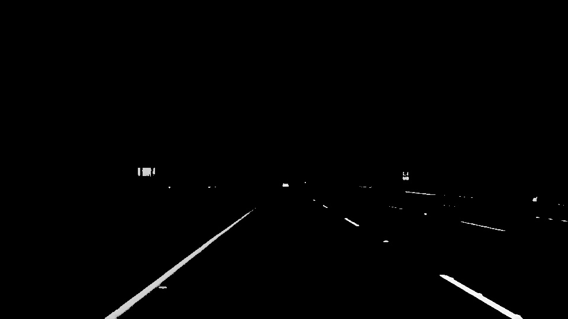
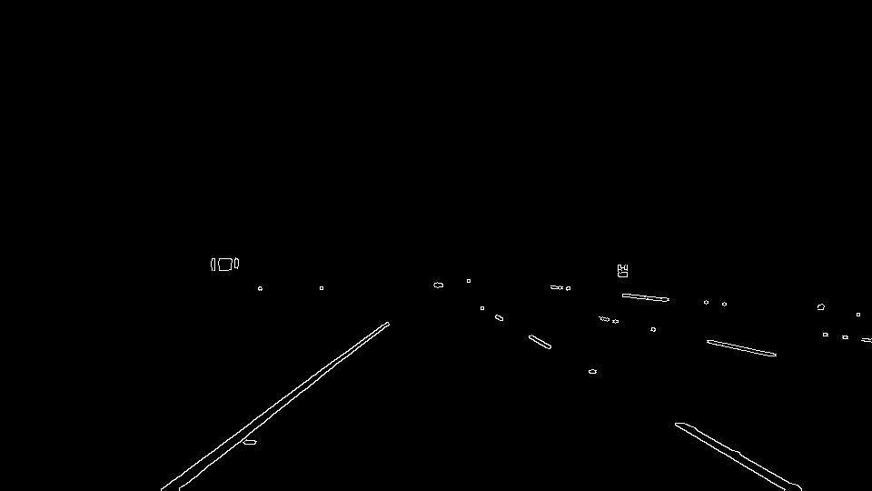
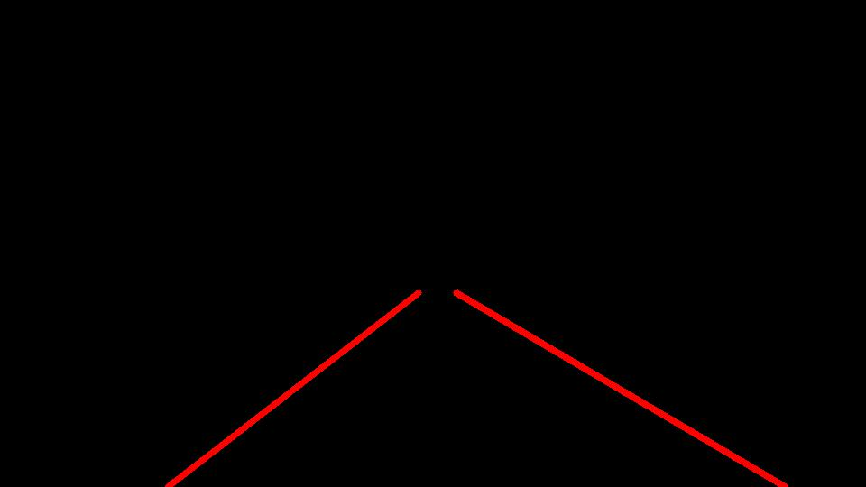
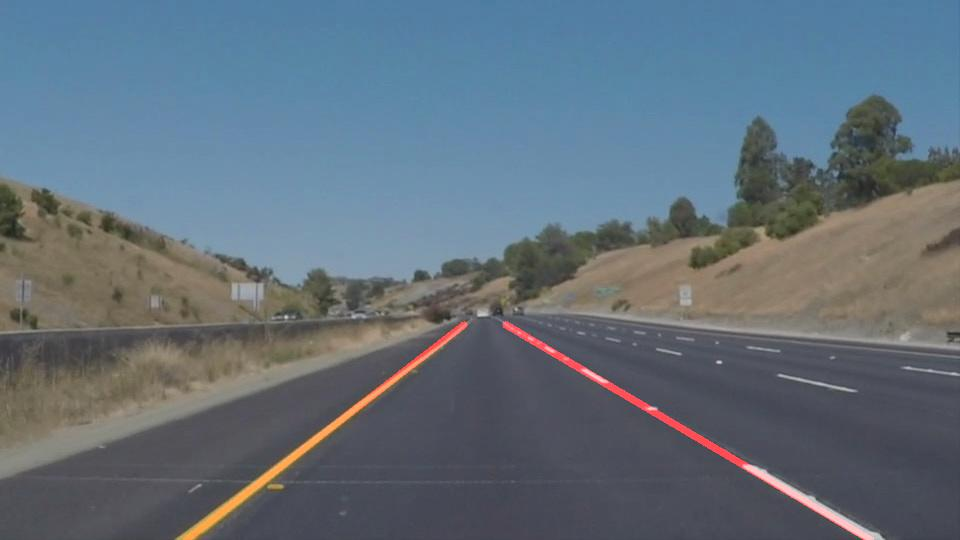
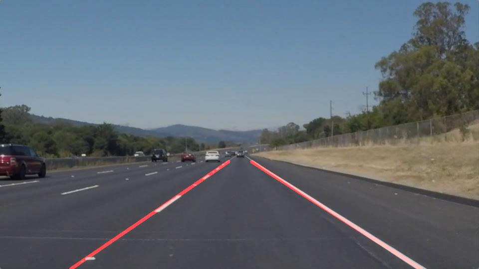
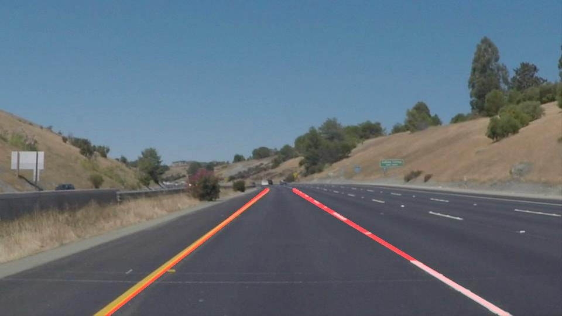

# **Finding Lane Lines on the Road**

Overview
---

When we drive, we use our eyes to decide where to go.  The lines on the road that show us where the lanes are act as our constant reference for where to steer the vehicle.  Naturally, one of the first things we would like to do in developing a self-driving car is to automatically detect lane lines using an algorithm.

In this project, I detect lane lines in images and videos using Python and OpenCV.

## Table of contents

* [Pipeline](#pipeline)
* [Images](#images)
* [Videos](#videos)

## Pipeline

My pipeline consists of the following steps. First, I convert the images to grayscale and then I apply a white and yellow mask in HLS color space to better detect white and yellow lanes in the road. Here is the result:

Next, I apply a Gaussian Blur before applying the images to the Canny edge detector. Here is the Canny output:

I apply the region of interest to the images and take the Hough lines to obtain the following result:

To represent the original color image with the estimated lines on top of it a weighted image is used:

In order to draw a single line on the left and right lanes, following steps in the draw_lines() function are followed:
* First, lines are divided in left and right lines as well as deleting possible horizontal lines.
* Then, we need to take the average position of the lines (mean slope and intercept) to get a single line per lane.
* Finally, lines are extrapolated so that they start at the bottom of the road and finish at the end of our region of interest.
* For representation, I have taken a weighted average over last 10 frames.

## Images
Here are the outputs for some of the images:

  

## Videos
The pipeline is tested in three different videos that can be found in `./test_videos`. The output of these videos with the detected lanes drawn on them can be found in `./test_videos_output`.
